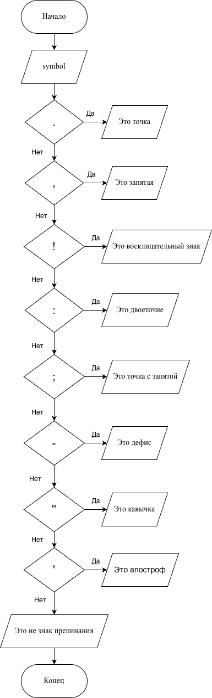

# Домашнее задание к работе 7

## Условие задачи

##### Написать программу, которая выводит название введенного знака препинания.
---


## 1. Алгоритм и блок-схема

### Алгоритм

1. Начало

2. Ввод знака препинания:
    - `symbol`
3. `switch(symbol)`
	- если `symbol == '.'`, то вывести "Это точка"
	- если `symbol == ','`, то вывести "Это запятая"
	- если `symbol == '!'`, то вывести "Это восклицательный знак"
	- если `symbol == ':'`, то вывести "Это двоеточие"
	- если `symbol == ';'`, то вывести "Это точка с запятой"
	- если `symbol == '-'`, то вывести "Это дефис"
	- если `symbol == '\"'`, то вывести "Это кавычка"
	- если `symbol == '\''`, то вывести "Это апостроф"
	- иначе вывести "Это не знак препинания"
4. Конец

### Блок-схема



  

[Ссылка на draw.io](https://viewer.diagrams.net/?tags=%7B%7D&lightbox=1&highlight=0000ff&edit=_blank&layers=1&nav=1&title=%D0%94%D0%97%20%E2%84%967.drawio&dark=auto#Uhttps%3A%2F%2Fdrive.google.com%2Fuc%3Fid%3D1sg-hR_HAl8rj6GBwTSdKklGRPP7we4NC%26export%3Ddownload)

---

  

## 2. Реализация программы

```c
#include <stdio.h>
#include <locale.h>

int main()
{
    setlocale(LC_ALL, "RUS");
    char symbol;

    printf("Введите знак препинания: ");
    scanf("%c", &symbol);

    switch (symbol)
    {
    case '.':
        printf("Это точка\n");
        break;
    case ',':
        printf("Это запятая\n");
        break;
    case '!':
        printf("Это восклицательный знак\n");
        break;
    case '?':
        printf("Это вопросительный знак\n");
        break;
    case ':':
        printf("Это двоеточие\n");
        break;
    case ';':
        printf("Это точка с запятой\n");
        break;
    case '-':
        printf("Это дефис\n");
        break;
    case '\"':
        printf("Это кавычка\n");
        break;
    case '\'':
        printf("Это апостроф\n");
        break;
    default:
        printf("Это не знак препинания!\n");
        break;
    }

    return 0;
}
```

# 3. Результаты работы программы

```bash
Введите знак препинания: ,
Это запятая
```

# 4. Информация о разработчике

#### Сафонов Павел Романович бИПТ-251